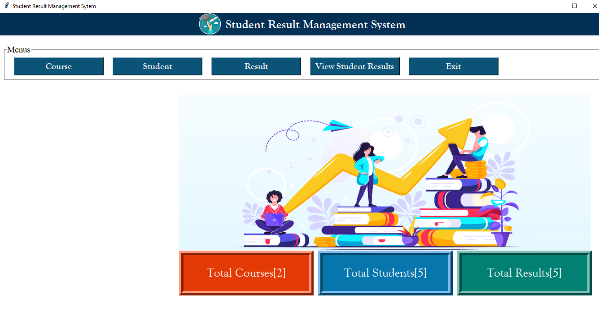
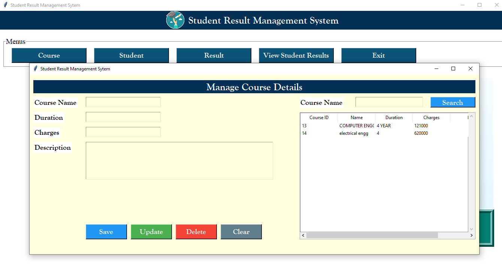
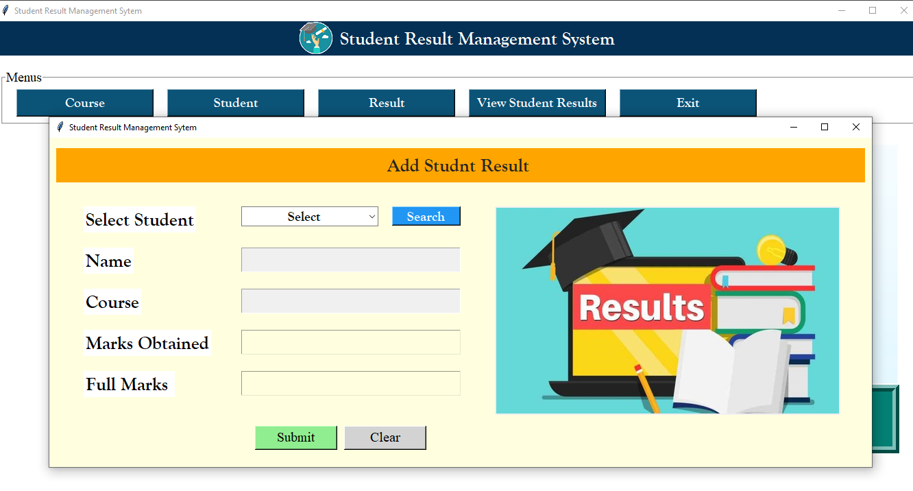
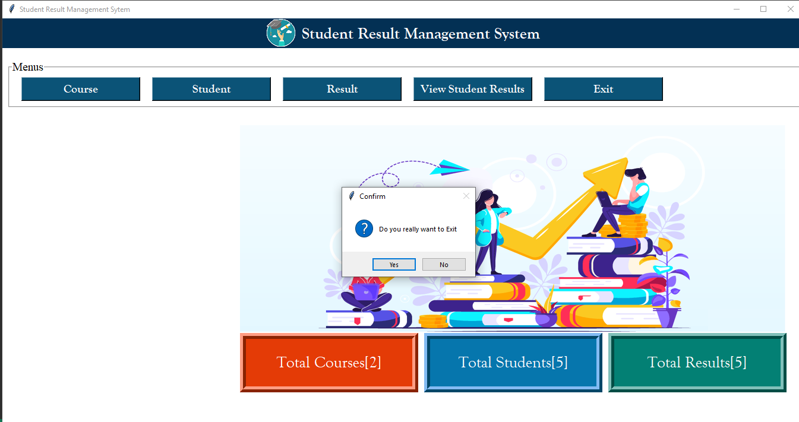

# Student Result Management System

## Table of Contents
- [Description](#description)
- [Screenshots](#screenshots)
- 
## Description
The Student Result Management System, built with Python Tkinter, allows management of student records, input and update of marks, and automatic calculation of totals and percentages.

## Screenshots

### Student Information

### Result Display

### View Student Result

### Exit Screen

